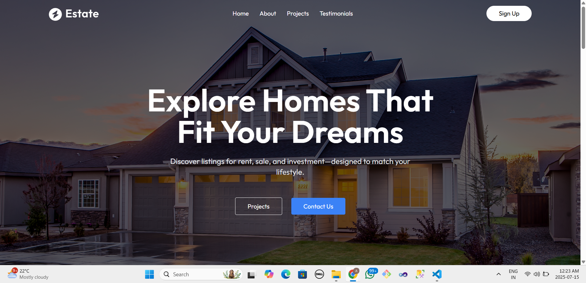
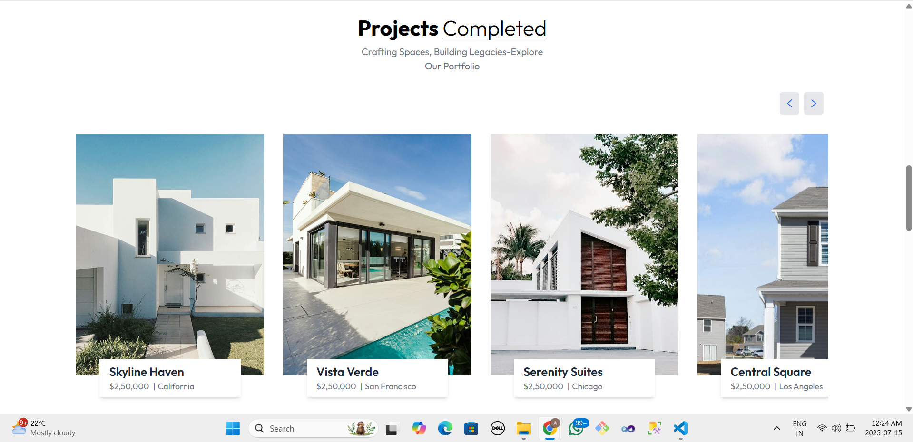
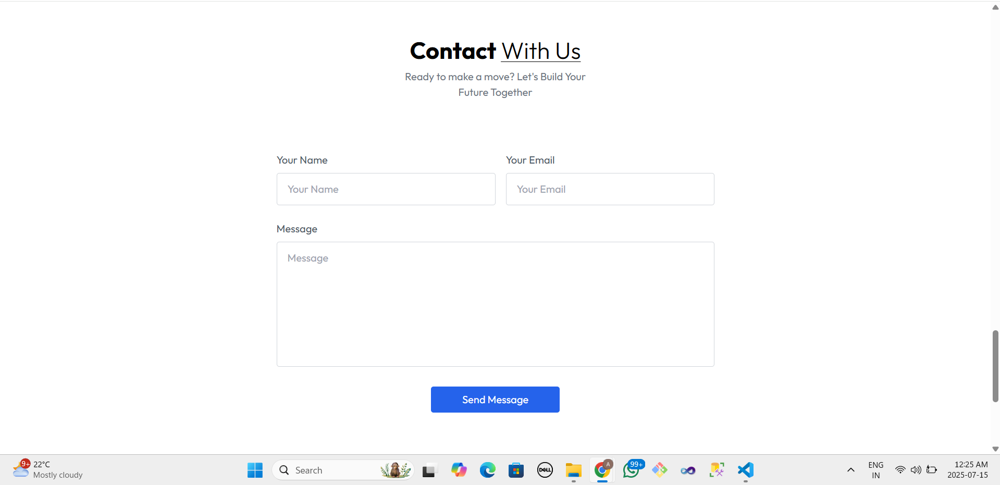

# 🏠 Houseify

Houseify is a modern real estate landing page built using **React.js**, **Tailwind CSS**, and **Vite**. It showcases featured property listings, brand information, customer testimonials, and a contact form integrated with Web3Forms — all designed with clean UI and smooth animations.

## 🚀 Demo

🔗 [Live Demo](https://houseify-dtkv.vercel.app)

## 📸 Screenshots





---
## 🛠️ Tech Stack

- **React.js** (with functional components and hooks)
- **Tailwind CSS** (for fast and responsive styling)
- **Framer Motion** (for animations)
- **Web3Forms API** (for form submission)
- **Vite** (build tool)
- **Vercel** (deployment)

---

## 📂 Features

- ✅ Responsive design for all devices
- ✅ Animated page transitions using Framer Motion
- ✅ Projects slider with smooth scroll
- ✅ Testimonials with star ratings
- ✅ Working contact form using Web3Forms
- ✅ .env integration for secure access key handling

---

---

## ⚙️ Installation

```bash
# Clone the repository
git clone https://github.com/Alfiya-heba/houseify.git

# Navigate to the project folder
cd houseify

# Install dependencies
npm install

# Run the project
npm run dev
🔐 Environment Variables
Create a .env file in the root and add your Web3Forms access key:

env
Copy code
VITE_WEB3FORMS_ACCESS_KEY=your_access_key_here

